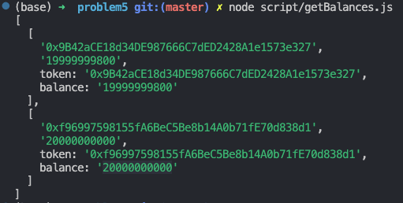

I deployed the ERC20 token contract on two addresses

- 0xf96997598155fA6BeC5Be8b14A0b71fE70d838d1
- 0x9B42aCE18d34DE987666C7dED2428A1e1573e327

the wallet 0x60bB6c1B4a0F5B1ea820be6c762384982b8a658c has balance for both token
for first token address: this wallet has 19999999800 wei
for the second token address: this wallet has 20000000000 wei

After running the script in script/getBalances.js using command node script/getBalances.js

we can see that it will print out this result.

