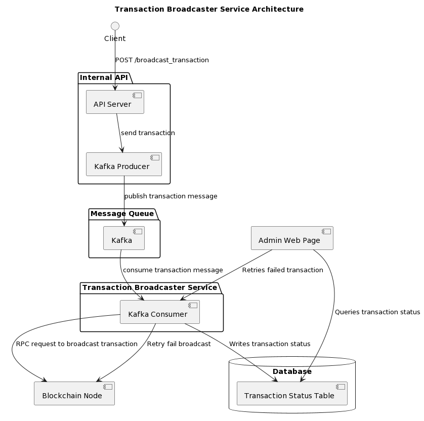
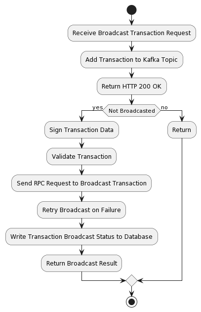
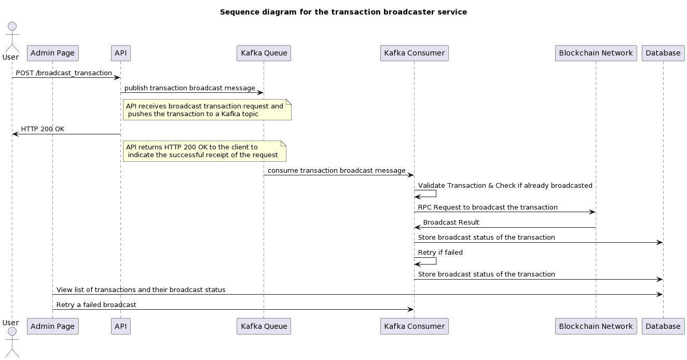

## Components

### The following components are needed in this design

- API Server (Kafka Producer): To receive POST requests with message type and data as parameters, and return signed transactions.
- Kafka Queue: To store the transaction message in case the service restarted.
- Transaction Signer (Kafka Consumer): To sign the data using the private key of the sender then broadcast the signed transaction to the blockchain network and log the status of the transaction.
- Transaction Status Database: To store the status of transactions.
- Admin Panel: To provide a user interface to the admin to view and retry failed transactions.

## Components Diagram

#### The following picture is the overall flow of the system.

## Architecture

#### The following is the detailed flow of the system.

1. The internal API receives a broadcast transaction request and publishes the transaction to Kafka Queue. The API server returns HTTP 200 OK to the client to indicate the successful receipt of the request. It returns 500 on any error.

2. The transaction broadcaster service consists of multiple instances of a Kafka consumer that subscribe to the same Kafka topic. Each consumer instance is responsible for signing the transaction data and broadcasting the signed transaction to the EVM-compatible blockchain network.

3. Before broadcasting the signed transaction, the consumer instance validates the transaction and checks if it has already been broadcasted by querying the transaction status database. If the transaction is valid and has not been broadcasted, the consumer instance sends a RPC request to the blockchain node to broadcast the transaction.

4. If the broadcasted transaction fails, the consumer instance retries the broadcast automatically. The number of retries and the time interval between each retry can be configured.

5. The consumer instance also writes the transaction broadcast status to a database to keep track of the list of transactions that have passed or failed.

6. An admin can view the list of transactions and their broadcast status by accessing the web page. The admin can also retry a failed broadcast at any time by clicking the retry button.

7. To ensure that the broadcast of all transactions is fulfilled even if the broadcaster service restarts unexpectedly, the Kafka consumer instances can store the offsets of the transactions they have processed in a persistent storage, such as a database. When a consumer instance restarts, it resumes consuming from the stored offset, ensuring that no transactions are missed.

### Activity Diagram

### Sequence Diagram

